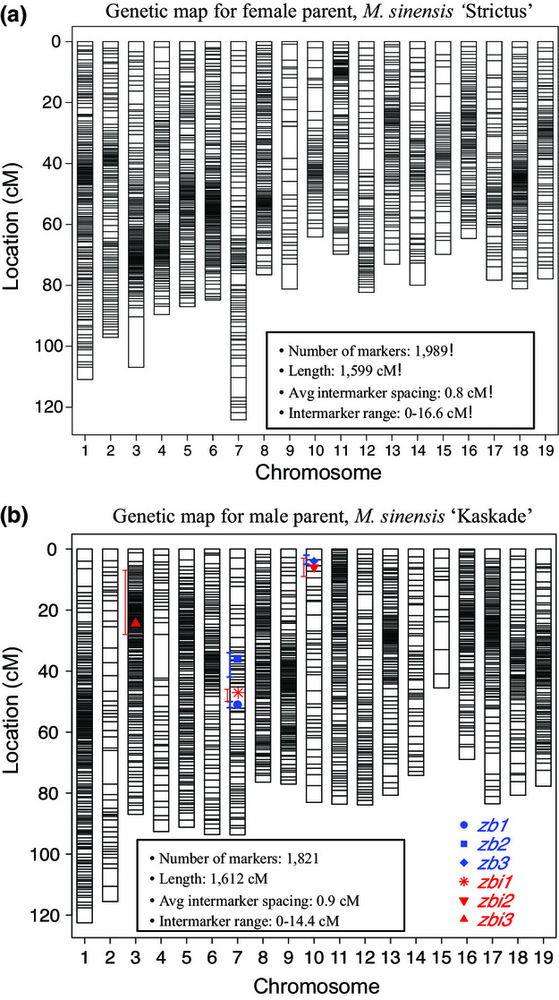
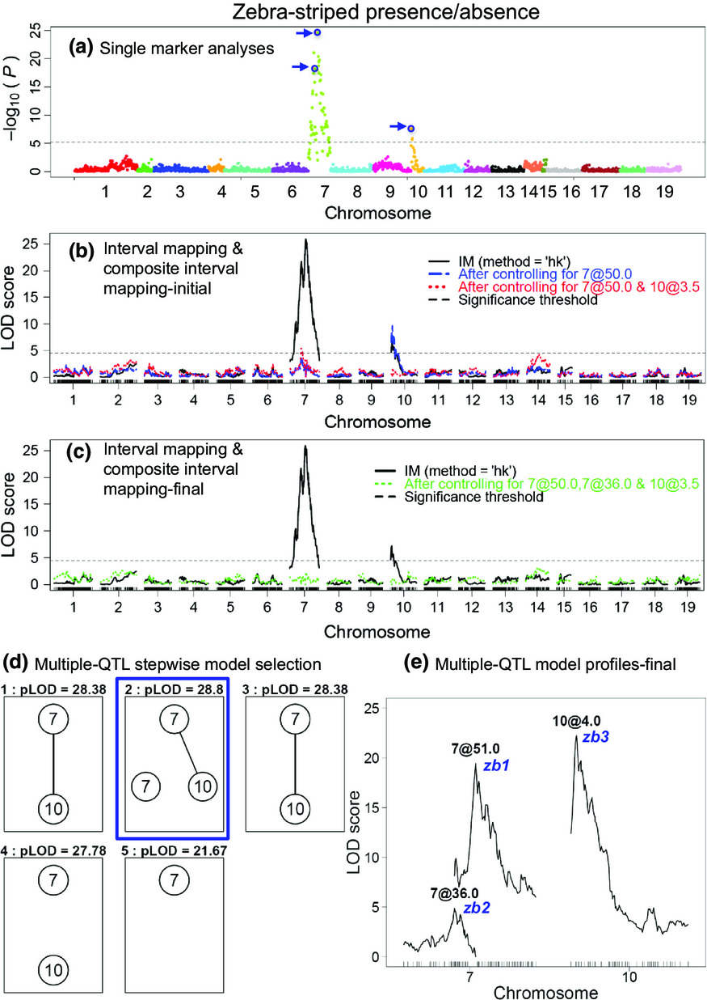

My thesis project focused on constructing high-density genetic maps for _Miscanthus sinensis_ (a bioenergy crop) using next generation genotyping by sequencing (GBS) technique. The utility of the map was confirmed by locating quantitative trait loci (QTL) for the zebra‐striped trait. Another focus of this project was to identify QTL for biomass yield and adaptation traits in _Miscanthus_ using populations derived from a multicross design sharing one common parent. 

